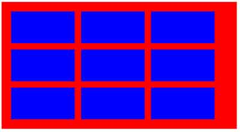

#[task0001](https://github.com/baidu-ife/ife/tree/master/task/task0001)

##6.盒模型及定位

###任务描述

- 用两种方法来实现一个背景色为红色、宽度为960px的
在浏览器中居中 

    [效果展示](http://www.liyaoli.com/demo/ife/task0001/box-model-postion/item1.html)

- 有的圆角矩形是复杂图案，无法直接用border-radius，请在不使用border-radius的情况下实现一个可复用的高度和宽度都自适应的圆角矩形

    [效果展示](http://www.liyaoli.com/demo/ife/task0001/box-model-postion/item2.html)

- 用两种不同的方法来实现一个两列布局，其中左侧部分宽度固定、右侧部分宽度随浏览器宽度的变化而自适应变化
 

    [效果展示](http://www.liyaoli.com/demo/ife/task0001/box-model-postion/item3.html)

- 用两种不同的方式来实现一个三列布局，其中左侧和右侧的部分宽度固定，中间部分宽度随浏览器宽度的变化而自适应变化

    [效果展示](http://www.liyaoli.com/demo/ife/task0001/box-model-postion/item4.html)

- 实现一个浮动布局，红色容器中每一行的蓝色容器数量随着浏览器宽度的变化而变化

 

 

    
   [效果展示](http://www.liyaoli.com/demo/ife/task0001/box-model-postion/item5.html)

##7.综合练习

基于设计稿中的设计图及标志实现页面，里面的内容、图片、配色均可自定义。

**2015.04.15 未完成**

原因：从“盒模型及定位”学习到了很多，知识点需要整理，我认为比完成“综合练习”价值更高。

##8. 验证

- `doctype`是什么，它是干啥用的

    文档类型声明，用来告诉浏览器应该以何种方式解析HTML和CSS。

- `ul`、`ol`、`dl`都适合用在什么地方

	ul：无序列表

    ol：有序列表

- 能够娓娓道来你是怎么理解HTML语义化的
- CSS选择器都有哪些
- `position`都有什么值，区别是什么
- 经典的清楚浮动代码中每一行语句都是干什么用的，为什么少了它不行
- 让一个HTML节点居中的各种实现方式
- 神马圣杯布局、双飞翼布局都是些什么东西
- 强大的负外边距都能干嘛
- 不小心提起文档流的时候还能接着解释到底啥是文档流