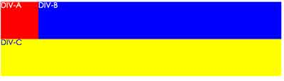

#[task0001](https://github.com/baidu-ife/ife/tree/master/task/task0001)

##6.盒模型及定位

###任务描述

- 用两种方法来实现一个背景色为红色、宽度为960px的
在浏览器中居中 

    [效果展示](http://www.liyaoli.com/demo/ife/task0001/box-model-postion/item1.html)

- 有的圆角矩形是复杂图案，无法直接用border-radius，请在不使用border-radius的情况下实现一个可复用的高度和宽度都自适应的圆角矩形

    [效果展示](http://www.liyaoli.com/demo/ife/task0001/box-model-postion/item2.html)

- 用两种不同的方法来实现一个两列布局，其中左侧部分宽度固定、右侧部分宽度随浏览器宽度的变化而自适应变化
 

    [效果展示](http://www.liyaoli.com/demo/ife/task0001/box-model-postion/item3.html)

- 用两种不同的方式来实现一个三列布局，其中左侧和右侧的部分宽度固定，中间部分宽度随浏览器宽度的变化而自适应变化

    [效果展示](http://www.liyaoli.com/demo/ife/task0001/box-model-postion/item4.html)

- 实现一个浮动布局，红色容器中每一行的蓝色容器数量随着浏览器宽度的变化而变化

 

 

    
   [效果展示](http://www.liyaoli.com/demo/ife/task0001/box-model-postion/item5.html)

##7.综合练习

基于设计稿中的设计图及标志实现页面，里面的内容、图片、配色均可自定义。

**2015.04.15 未完成**

原因：从“盒模型及定位”学习到了很多，知识点需要整理，我认为比完成“综合练习”价值更高。

##8. 验证

- `doctype`是什么，它是干啥用的

    答：文档类型声明，用来告诉浏览器应该以何种方式解析HTML和CSS。

- `ul`、`ol`、`dl`都适合用在什么地方

	ul：无序列表，最常用的。

    ol：有序列表，在当列表项目的每个列表项目前面需要一个递增值的时候使用。在大部分情况下，有序列表要么前面是个递增数值，要么前面没有任何标记。不建议使用有序列表实现类似于无序列表的表现。因为这样，有序列表本身的语义已经不正确了。
	
	dl：定义列表。用来标记已经定义的列表项，它们包括定义标题(dt)以及定义本身(dd)。
- 能够娓娓道来你是怎么理解HTML语义化的
	
	答：用合理的HTML标记以及其特有的属性（h1、h2等）去格式化内容。
	- 便于盲人等一些障碍人士使用特殊阅读装置的阅读
	- 搜索引擎的友好收录
	- 便于团队人员维护

- CSS选择器都有哪些

	- 基本选择器
		- 通配选择器： *
		- 元素选择器： div、p、h1
		- ID选择器： #id
		- 类选择器： .class
		- 群组选择器（将么一个选择器匹配的元素集合并）：selector1,selector……
	- 层次选择器
		- 后代选择器（注意与子代区别）:`div.wrapper p` (类名为wrapper的div元素的所有后代元素p)
		- 子选择器：`div.wrapper > p` (类名为wrapper的div元素的子代元素p,只要子代，不要孙代)
		- 相邻兄弟选择器：`E + F`(选择匹配的F元素，且匹配的F元素紧位于匹配的E元素后面)
		- 通用选择器：`E ~ F` （选择匹配的F元素，且位于匹配的E元素后的所有匹配的F元素）
	- 伪类选择器
		- 动态伪类选择器（一般按照LOVE/HATE原则，即“link-visited-hover-active”：
			- `E:link`，链接伪类选择器，且链接未被访问过
			- `E:visited`，链接伪类选择器，且链接已被访问过
			- `E:active`，用户行为伪类选择器，匹配元素被激活
			- `E:hover`，用户行为伪类选择器，用户鼠标停留在匹配元素上上
			- `E:focus`，用户行为伪类选择器，匹配元素获得焦点	
		- 目标伪类选择器：`E:target`
		- 语言伪类选择器：`E:lang(lang)`
		- UI元素状态伪类选择器
			- `E:checked`，选中状态伪类选择器，匹配选中的复选按钮或单选按钮表单元素
			- `E:enabled`，启用状态伪类选择器，匹配所有启用的表达元素
			- `E:disabled`，不可用状态伪类选择器，匹配所有金庸的表单元素
		- 结构伪类选择器
			- `E:first-child`，父元素的第一个子元素。与`E:nth-child(1)`等同。
			- `E:last-child`，父元素的最后一个子元素。与`E:nth-last-child(1)`等同。
			- `E:root`，选择匹配元素E所在文档的根元素。在HTML文档中，根元素始终是html
			- `E F:nth-child(n)`，选择父元素E的第n个子元素F。
			- `E F:nth-last-child(n)`，选择元素E的倒数第n个子元素F。
			- `E:nth-of-type(n)`，选择父元素内具有指定类型的第n个E元素。比如：`div div:nth-child(2n+1)`
			- `E:nth-last-of-type(n)`,选择父元素内具有指定类型的倒数第n个E元素。
			- `E:first-of-type`，选择父元素内具有指定类型的第一个E元素，与`E:nth-of-type(1)`等同。
			- `E:last-of-type`，选择父元素内具有指定类型的最后一个E元素，与`E:nth-last-of-type(1)`。
			- `E:only-child`，选择父元素只包含一个子元素，且该子元素匹配E元素。
			- `E:only-of-type`，选择父元素只包含一个同类型的子元素，且该子元素匹配E元素
			- `E:empty`，没有子元素的元素，而且该元素也不包含任何文本节点。
		- 否定伪类选择器：`E:not(F)`，匹配所有除元素F外的E元素。
	- 伪元素选择器
		- `::first-letter/:first-letter`，用来选择文本块的第一个字母，除非同一行中包含一些其他元素。
		- `::fitst-line/:fitst-line`，用来匹配第一行文本。
		- `::after、::before/：after、:before`，不是指存在于标记中的内容，可以插入额外内容的位置。尽管生成的内容不会成为DOM的一部分，但它同样可以设置样式。也可用于清除浮动。
		- `::selection`，用来匹配突出的文本。
	- 属性选择器
		- `E[attr]`，选择匹配具有属性attr的E元素。
		- `E[attr=val]`，选择选择匹配具有属性attr的E元素，且值为val。
		- `E[attr|=val]`，属性attr是一个具有val或者以val-开始的属性值。
		- `E[attr~=val]`，属性attr具有多个空格分割的值，其中一个值为val。
		- `E[attr*=val]`，属性attr，其值任意位置包含了“val”。换句话说，字符串val与属性值中的任意位置相匹配。
		- `E[attr^=val]`，属性attr的值以val开头的任何字符串。
		- `E[attr$=val]`，属性值以val结尾的任何字符串，刚好与`E[attr$=val]`相反。
		

- `position`都有什么值，区别是什么

	- static，默认值。
	- relative，元素框偏移某个部分。元素仍保持其未定位前的形态，它原本所占的文档流空间仍保留。
	- absolute，从文档流中删除。相对其position值为非static的祖先元素。
	- fixed，相对视窗固定
	
	对于非根元素，如果其postion值为static和relative，包含块则由最近的块级框、表单元格或行内块祖先框的内容边界构成。
	
	如果绝对定位的元素并未设定其left、top等属性，它未定位时原本的位置对齐。

- 经典的清楚浮动代码中每一行语句都是干什么用的，为什么少了它不行

	[http://liyaoli.com/2014-12-17/clear-float-and-BFC.html](http://liyaoli.com/2014-12-17/clear-float-and-BFC.html)

- 让一个HTML节点居中的各种实现方式

	[http://liyaoli.com/2015-04-14/alibaba-written-examination.html](http://liyaoli.com/2015-04-14/alibaba-written-examination.html)

- 神马圣杯布局、双飞翼布局都是些什么东西
- 强大的负外边距都能干嘛

	[http://liyaoli.com/2015-04-15/minus-margin.html](http://liyaoli.com/2015-04-15/minus-margin.html)

- 不小心提起文档流的时候还能接着解释到底啥是文档流

	[http://www.zhihu.com/question/21911352](http://www.zhihu.com/question/21911352)